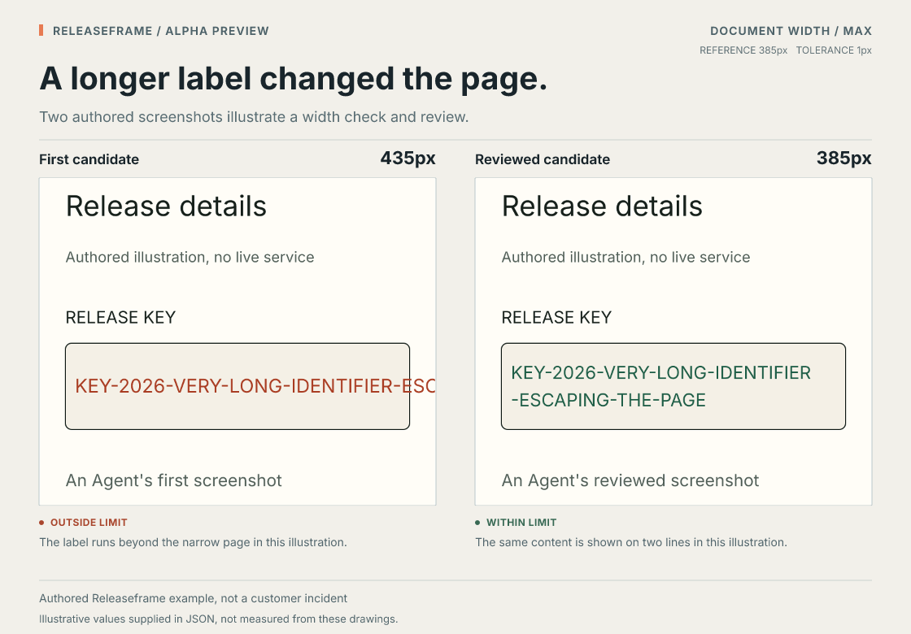
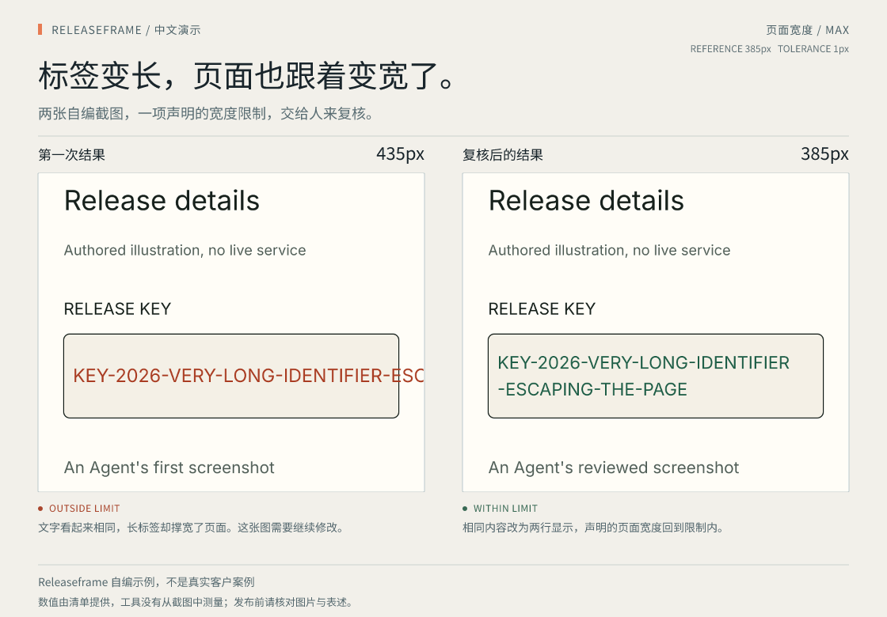

# Releaseframe

**Show the result people need to review.**

Give Releaseframe two already captured PNG screenshots and one declared numeric limit. One command writes a shareable comparison image, ALT text, an editable X post draft and the input hashes and outcome in JSON. It runs locally without a browser, account, model call or upload.



This early preview is for a coding agent that has finished a small UI fix or bug handoff and needs to explain a before/after result to a human. The screenshots must already exist. Releaseframe checks image dimensions and **the values you declare**; it cannot discover measurements, inspect source code or decide whether a screenshot proves the claim.

## First result

Node.js 22+ is required. This preview is distributed as a GitHub release tarball, not on npm:

```sh
npm install --save-dev https://github.com/codex-improvement-lab/releaseframe/releases/download/v0.1.0-alpha.3/codex-improvement-lab-releaseframe-0.1.0-alpha.3.tgz
npx releaseframe demo --out ./releaseframe-demo
```

The demo uses **authored illustrations and declared example numbers**, not a customer incident. Open `releaseframe-demo/card.png`, then read `alt.txt`, `post.txt` and `review.json`. The alpha.3 layout gives both screenshots more space, with a shared reference/tolerance line and compact, explicit status labels. The PNG remains 1120×780.

To make your own card, copy [the example manifest](examples/demo.json), change both image paths and every claim, and run:

```sh
npx releaseframe render ./my-card.json --out ./my-card --json
```

`--out` must be an unused directory. Existing output is never overwritten. The CLI reports absolute output paths and a compact JSON summary with `--json`. The `renderManifest({manifestPath, outputDir})` API is also exported for an Agent that already has a Node workflow.

The input declares `metric.baseline`, `metric.tolerance`, a `mode` (`at-most` or `at-least`) and each panel's `value`. The badge is derived from those numbers. For example, a width limit of 385px with 1px tolerance rejects 435px and accepts 385px. The tool **does not measure those values from the image pixels**. It records the distinction in `review.json`.

Each panel names a local PNG. Both images must have identical dimensions, be 100–8000 pixels in each direction and at most 10 MB each. `cropY` optionally moves the visible window down within both screenshots; it defaults to zero and is measured in source-image pixels. The enlarged alpha.3 presentation keeps the same visible source window as alpha.2 for the same input and `cropY`. Keep the two captures at a comparable viewport and state, and supply sharp captures for the larger display. A crop can hide information, so check the final PNG rather than treating a passing JSON result as visual approval.

The manifest also requires a visible source label, a source URL, a limitation sentence and text for both panels. `postDraft` is caller-written; Releaseframe appends `releaseUrl` once and applies a conservative X length check. It constructs ALT text from the declared numbers and caller-written descriptions, rejecting output over 1,000 characters. The default card font is bundled OFL Inter. For Chinese or other covered text, set `font` to one local TTF/OTF file relative to the manifest (or an absolute path). The selected font must cover the whole card, including its English badges. Missing glyphs and over-wide labels are rejected before output is created; captions wrap to at most two measured lines. No system fonts are scanned or downloaded.

Only `card.png`, `alt.txt`, `post.txt` and `review.json` leave the renderer. The PNG contains the **visible crop**. The original images are neither modified nor included as hidden layers in the output. The output is **not a privacy scrubber**; review the original screenshots, card and wording before sharing them. Releaseframe never submits a post or changes an account.

## Chinese cards and local fonts



The [Chinese example](examples/demo-zh.json) uses the same authored screenshots. Place a suitable licensed font such as [Noto Sans CJK SC Regular](https://github.com/notofonts/noto-cjk/blob/main/Sans/OTF/SimplifiedChinese/NotoSansCJKsc-Regular.otf) beside that manifest, named `NotoSansCJKsc-Regular.otf`, or change its `font` path. The full Chinese font is **not bundled**. Then run:

```sh
npx releaseframe render ./examples/demo-zh.json --out ./chinese-card --json
```

The renderer reads only the explicitly named font (up to 20 MB) and draws its shaped outlines. `review.json` records its exact SHA-256 and family. No installation, global startup change or online font service is needed. A regular-only font remains regular; a variable weight axis is used when available. Check your font's license before sharing outputs. Font collections and webfont containers are not accepted; general complex-script and emoji support is not promised. Latin and Chinese paths are exercised in tests, with the full Noto font additionally reviewed locally.

Character limits still apply, but equal character counts do not mean equal width. If a field is too wide, shorten that field or choose a narrower font. The numeric labels and badges retain the same declared-value meaning.

## Why use it?

For a pair of offline screenshots, the existing complete route is to write an HTML/CSS card and render it. We did that for a [Breakcase alpha.3 announcement](docs/evaluation.md), then separately prepared image ALT and the post. Releaseframe keeps the repeated layout, threshold badge, file checks and delivery files behind one manifest. This is an observed reduction in repeated setup steps, not a measured claim that agents save time or will prefer this product.

[Shotcraft](https://github.com/miopea/shotcraft) starts from a running web app and makes many kinds of screenshots. [Visual Factory Kit](https://github.com/cgallic/visual-factory-kit) provides a broad JSON/brand-pack image factory with provenance and QA; its stock before/after and release templates at the pinned comparison revision are text compositions, so our particular supplied two-screen image needs another template there. Both remain strong options for their intended jobs. See [the local comparison and its limits](docs/evaluation.md).

MIT for Releaseframe code. The bundled Inter font is covered by the [SIL Open Font License](assets/fonts/OFL.txt), with its source pinned in [font provenance](docs/font-provenance.md). Elias S.W. / [Codex Improvement Lab](https://github.com/codex-improvement-lab).
